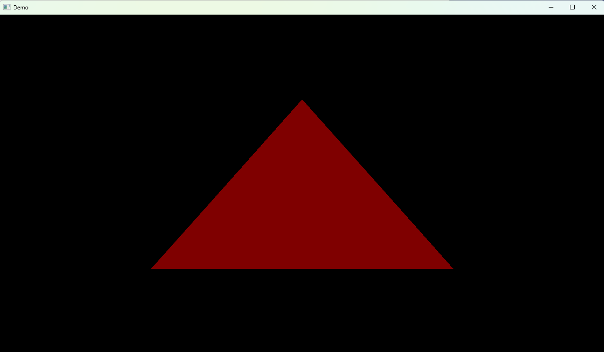

# opengl_boiler

A reusable C++ / OpenGL 3.3 starter template built with CMake. Clone it, subclass `engine::Application`, and start drawing.

## Stack
C++20 · CMake · GLFW · glad · MSVC (Visual Studio 2022)

## Layout
- `engine/` – static library: `Window`, `Application`, `Shader`, `VertexBuffer`, `VertexArray`, `VertexLayout`
- `app/` – your project; `main.cpp` subclasses `Application`
- `libraries/` – third-party dependencies

## Build
Open the folder in Visual Studio 2022, select the **x64 Debug** preset, and run `opengl_boiler.exe`.
